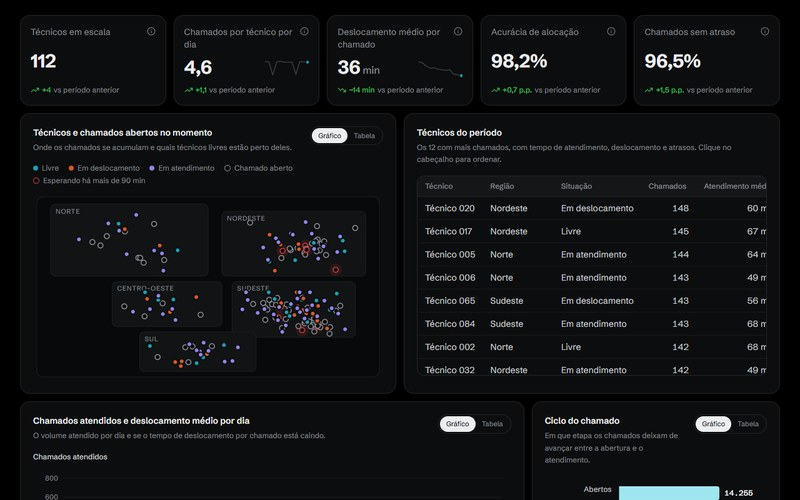
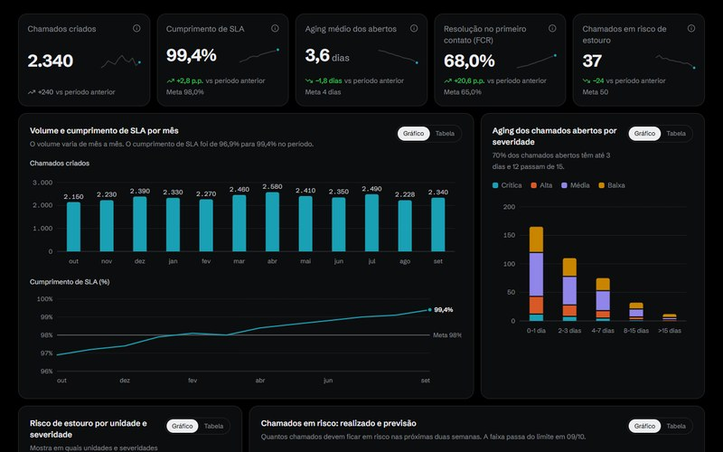
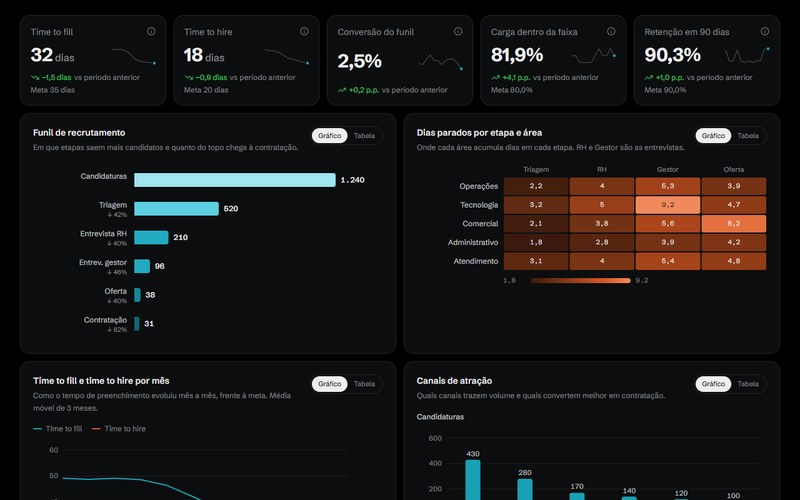
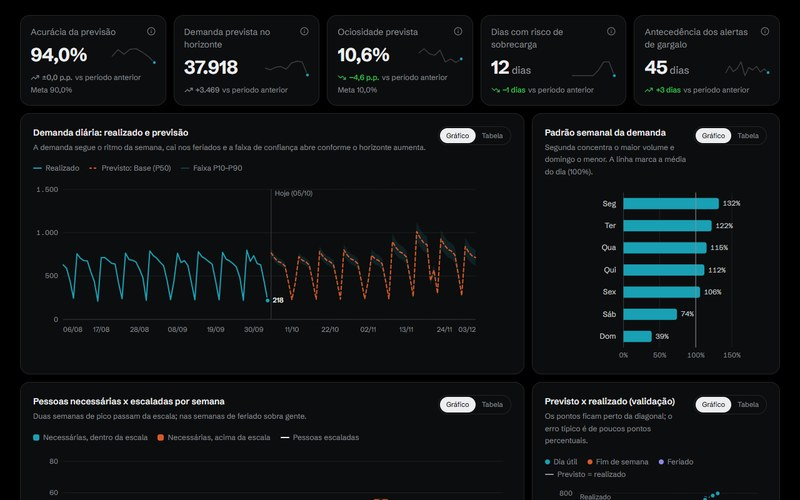
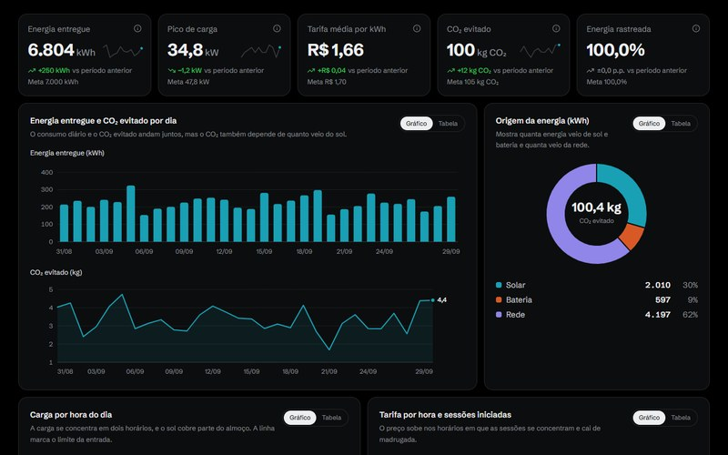

<h1 align="center">João Vitor Belchior</h1>

<p align="center">Analista de dados · Ciência da Computação na FIAP · São Paulo</p>

<p align="center">
  <a href="https://jbelkior.site"></a>
  <a href="https://www.linkedin.com/in/jbelkior"></a>
  <a href="mailto:joaobelkior29@gmail.com"></a>
</p>

## Sobre

Monto os painéis que as lideranças usam para decidir, automatizo o que ainda é feito à mão e uso IA onde ela poupa trabalho. Gosto de cuidar do caminho inteiro: da ingestão e modelagem em SQL e Python até o painel em Power BI e a automação com n8n.

```sql
SELECT nome, cargo, formacao, foco
FROM   perfil
WHERE  usuario = 'jbelkior1';

-- nome     | João Vitor Belchior
-- cargo    | Analista de dados
-- formacao | Ciência da Computação · FIAP (2026–2029)
-- foco     | painéis, automação e IA aplicada a operações
```

## Stack

| | |
|---|---|
| **Dados e BI** |     |
| **Python** |      |
| **Automação e IA** |     |
| **Web e banco** |      |
| **Ferramentas** |    |

## Dashboards

Clique num painel para abrir e mexer nos filtros.

<table>
<tr>
<td width="50%" valign="top">
<a href="https://jbelkior.site/dashboards/workforce-dispatch-engine"></a><br>
<b><a href="https://jbelkior.site/dashboards/workforce-dispatch-engine">Despacho de técnicos</a></b><br>
<sub>Power BI · quem está livre, onde os chamados se acumulam e quanto tempo se perde em deslocamento</sub>
</td>
<td width="50%" valign="top">
<a href="https://jbelkior.site/dashboards/enterprise-sla-analytics"></a><br>
<b><a href="https://jbelkior.site/dashboards/enterprise-sla-analytics">SLA e resolução de chamados</a></b><br>
<sub>Power BI · cumprimento de SLA, aging por severidade e chamados em risco de estouro</sub>
</td>
</tr>
<tr>
<td width="50%" valign="top">
<a href="https://jbelkior.site/dashboards/talent-acquisition-intelligence"></a><br>
<b><a href="https://jbelkior.site/dashboards/talent-acquisition-intelligence">Funil de recrutamento</a></b><br>
<sub>Power BI · conversão por etapa, dias parados e carga dos recrutadores</sub>
</td>
<td width="50%" valign="top">
<a href="https://jbelkior.site/dashboards/predictive-capacity-planning"></a><br>
<b><a href="https://jbelkior.site/dashboards/predictive-capacity-planning">Previsão de demanda e capacidade</a></b><br>
<sub>Python + Power BI · demanda prevista com faixa de confiança e pessoas necessárias por semana</sub>
</td>
</tr>
<tr>
<td width="50%" valign="top">
<a href="https://jbelkior.site/dashboards/smart-ev-traceability"></a><br>
<b><a href="https://jbelkior.site/dashboards/smart-ev-traceability">Recarga de carros elétricos</a></b><br>
<sub>Python · energia entregue, carga por hora, tarifa e CO₂ evitado</sub>
</td>
<td width="50%" valign="middle">
Cada painel é uma réplica de um dashboard que montei: os indicadores, os filtros e a disposição seguem o original, e todos os números são fictícios.<br><br>
<a href="https://jbelkior.site">Abrir o portfólio</a>
</td>
</tr>
</table>

## Projetos

| Projeto | O que é | Links |
|---|---|---|
| **Ponto W** | Sistema de gestão de recarga elétrica comercial, do EV Challenge 2026 (GoodWe × FIAP). Quatro painéis: motorista, totem, franqueado e franqueadora. React, TypeScript e Recharts. | [código](https://github.com/jbelkior1/gs_goodwe) · [no ar](https://jbelkior1.github.io/gs_goodwe/) |
| **Ponto W em VR** | A partir de uma foto do estacionamento, estima se o eletroposto cabe e abre o local em realidade virtual no celular (WebXR). | [código](https://github.com/jbelkior1/gs_vr) · [no ar](https://jbelkior1.github.io/gs_vr/) |
| **Machine Learning** | Análise bivariada e regressão linear simples (OLS) em Python, com a leitura de cada resultado: correlação de 0,976 e R² de 0,952. | [código](https://github.com/jbelkior1/Machine_Learning) |

## Formação

**Ciência da Computação · FIAP** (2026–2029, cursando)
Exercícios e entregas da faculdade em [Python-FIAP](https://github.com/jbelkior1/Python-FIAP), [Entregaveis_Python_FIAP](https://github.com/jbelkior1/Entregaveis_Python_FIAP) e [Entregaveis_GS_FIAP](https://github.com/jbelkior1/Entregaveis_GS_FIAP).

## Contato

Aberto a vagas e projetos em análise de dados e automação com IA. O caminho mais rápido é o [LinkedIn](https://www.linkedin.com/in/jbelkior) ou o formulário do [portfólio](https://jbelkior.site).
